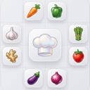
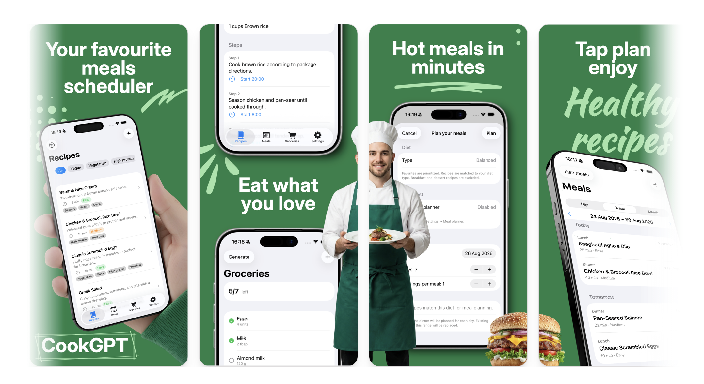

<div>
<h3>CookGPT</h3>
<p><strong>CookGPT - Gourmet Plan & Taste</strong> is a native <strong>SwiftUI</strong> iOS app for recipes, meal planning, and grocery lists — with step timers on the Lock Screen and Dynamic Island.</p>
<a href="https://apps.apple.com/app/id6805535867"></a>
</div>

<br/><br/>

<div align="center">

[](https://apps.apple.com/app/id6805535867)
[](https://github.com/cook-gpt/cook-gpt/blob/main/LICENSE)
[](https://github.com/cook-gpt/cook-gpt)

<br/>
<br/>

<br/>

</div>

<hr>

Built by [xarlizard](https://github.com/xarlizard). Open source under [MIT](LICENSE).

## Features

- **Recipes** — browse, favorite, filter, scale servings, share, and edit custom recipes
- **Meals** — day / week / month schedule, manual scheduling, and auto meal planning
- **Groceries** — import from schedule or recipes, merge with custom items, checklist UI
- **Timers** — per-step cooking timers with Live Activities and Clock-style alarm sounds
- **Settings** — theme, categories, units, week start day, and full data reset

Landing site: [cook-gpt.pages.dev](https://cook-gpt.pages.dev)

## Quick start

Requires **Xcode 26** and **iOS 26.5** (iPhone or iPad).

```bash
git clone https://github.com/cook-gpt/cook-gpt.git
cd cook-gpt
open "src/CookGPT.xcodeproj"
```

Select a simulator or device, then **Run** (⌘R).

## Repository layout

| Path | Purpose |
|------|---------|
| `src/CookGPT/App/` | Entry point, settings store, sample data, reset |
| `src/CookGPT/Features/` | Recipes, Meals (Diet), Groceries, Settings screens |
| `src/CookGPT/Models/` | SwiftData domain models and enums |
| `src/CookGPT/Shared/` | Calendar, timers, formatting, reusable UI |
| `src/CookGPT/LiveActivity/` | Timer Live Activity (main app side) |
| `src/CookGPTTimerLiveActivity/` | Widget extension for Lock Screen / Dynamic Island |
| `website/` | Marketing site (React + Vite, Cloudflare Pages) |
| `specs/features/` | Numbered feature specs |

Each Swift source file includes a header comment describing its role. Key types use `///` documentation where helpful.

## Data & privacy

All recipes, meals, and grocery data stay **on device** (SwiftData). No account or backend required.

## Documentation

| Doc | Description |
|-----|-------------|
| [docs/README.md](docs/README.md) | Documentation index |
| [docs/development.md](docs/development.md) | Local setup and workflow |
| [docs/architecture.md](docs/architecture.md) | App structure and data flow |
| [docs/release-process.md](docs/release-process.md) | App Store versioning and release |
| [docs/app-store-connect.md](docs/app-store-connect.md) | App Store listing copy |
| [.cursor/rules.md](.cursor/rules.md) | Cursor AI editing rules |
| [.agents/skills/README.md](.agents/skills/README.md) | Agent skills catalog |
| [specs/features/](specs/features/) | Feature specifications |
| [CHANGELOG.md](CHANGELOG.md) | Release history |

## License

MIT — see [LICENSE](LICENSE).

---

## Repository documents

**README** | [Docs](docs/README.md) | [INSTRUCTIONS](INSTRUCTIONS.md) | [CHANGELOG](CHANGELOG.md) | [CONTRIBUTING](CONTRIBUTING.md) | [SECURITY](SECURITY.md) | [CODE_OF_CONDUCT](CODE_OF_CONDUCT.md)
